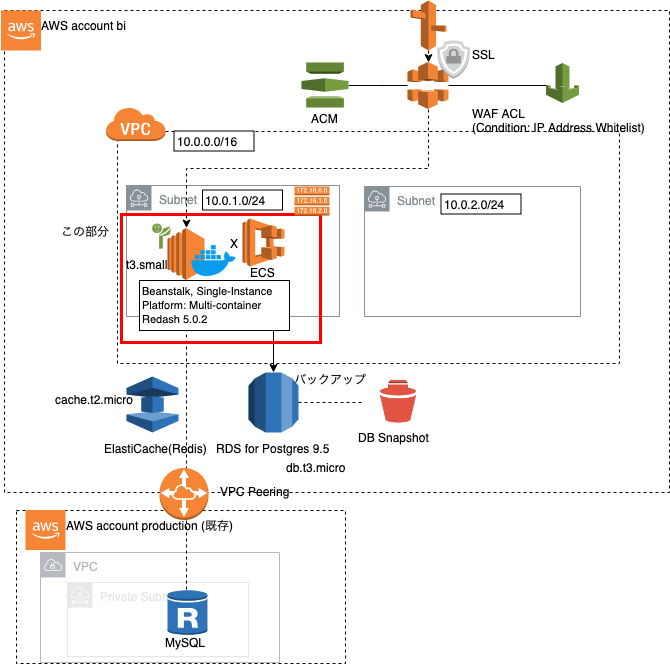

# Eigo-Mt-Fuji redash

[](https://github.com/getredash/redash)

## 構成図
* 以下の赤枠部分



## 事前準備
* [re:dashのdev-guide](https://redash.io/help/open-source/dev-guide/setup)を読んでおく

* AWS CloudWatch Log Groupを作成
  * `/aws/elasticbeanstalk/Test2-env-1/redash` と仮定
  * 変更したい場合は Dockerrun.aws.jsonの `logConfiguration` を置き換え
* ElasticBeanstalkアプリケーション作成
  * Platform: Multi docker container
  * Single Instance 
* RDS for Postgres 9.5 を作成
  * 代替案: Dockerrun.aws.jsonのcontainerDefinitionsにpostgresを追加
  * Dockerrun.aws.jsonの 環境変数 `REDASH_DATABASE_URL` に作成したインスタンス接続情報を適用

* ElastiCache(Redis) を作成
  * 代替案: Dockerrun.aws.jsonのcontainerDefinitionsにredisを追加
  * Dockerrun.aws.jsonの 環境変数 `REDASH_REDIS_URL` に作成したインスタンス接続情報を適用

* デプロイツール[eb cli](https://docs.aws.amazon.com/ja_jp/elasticbeanstalk/latest/dg/eb-cli3-install-osx.html)をセットアップ

## デプロイ(Dockerrun.aws.jsonをElasticBeanstalkにデプロイ)

* init (初回) 

```
$ eb init --profile {profile} test2
```

* deploy (test2アプリケーション上のTest2-env-1にデプロイ)

```
$ eb deploy --profile {profile} Test2-env-1
```

## 参考

* Redash docker-compose in local

```
# create base pg_dump (only github maintainer)
$ git clone github.com/getredash/redash.git redash-original
$ cd redash-original
$ docker-compose build # if no ports mapping for postgresql, add 15432:5432 before build.
$ docker-compose up
```

* Redash DDL取得 (local)

```
# drop schema (only if reset required.)

$ psql -h127.0.0.1  --port 15432 -Upostgres 
drop schema public cascade;
create schema public;

# create table in docker container(only at first contact)
$ docker exec -it {redash server container_id} /bin/bash
bin/run ./manage.py database create_tables
$ pg_dump -h127.0.0.1  --port 15432 -Upostgres postgres > redash-data.sql
```

* Redashテーブル作成(AWS)

```
# create tables
redash-db-ssh # connect to postgresql on aws
redash-db < redash-data.sql # restore
```

* 参考

```
https://redash.io/help/open-source/dev-guide/setup
https://stackoverflow.com/questions/32311366/alembic-util-command-error-cant-find-identifier
https://qiita.com/a-suenami/items/e231adc2e083ef9449f6
```
